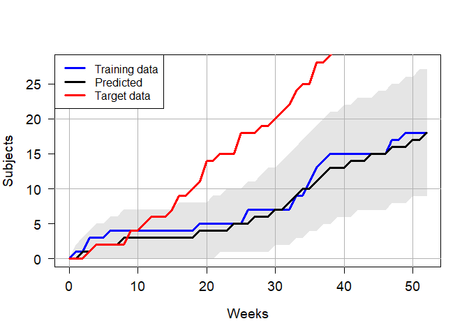

<!-- README.md is generated from README.Rmd. Please edit that file -->

# RCTRecruit

<!-- badges: start -->

[](https://github.com/imalagaris/RCTRecruit/actions/workflows/R-CMD-check.yaml)
[](https://app.codecov.io/gh/imalagaris/RCTRecruit)
<!-- badges: end -->

## Installation

Accurate prediction of subject recruitment for randomized clinical
trials (RCT) remains an ongoing challenge. Many previous prediction
models rely on parametric assumptions. We present functions for
non-parametric RCT recruitment prediction under several scenarios.

You can install the development version of RCTRecruit from
[GitHub](https://github.com/imalagaris/RCTRecruit) with:

``` r
devtools::install_github("imalagaris/RCTRecruit")
```

## Example

``` r
library(RCTRecruit)
LoadData(gripsYR1, ScreenDt, Enrolled)
#> 
#> Variables Enrolled and ScreenDt were successfully loaded
Time2Nsubjects()
#> Enrolling 50 subjects requires 137 weeks
#> 
#>  2.5%   50% 97.5% 
#>   137   137   137
GetDistance(gripsYR2Weekly$enrolled)
#>  2.5%   50% 97.5% 
#>    85    85    85
res <- GetWeekPredCI()
plot(res)
```


